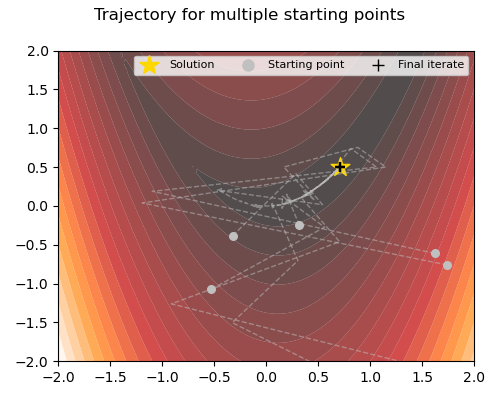
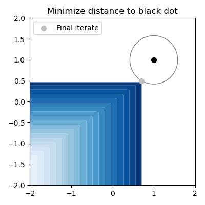

# ncOPT
This repository is for solving **constrained optimization problems** where objective and/or constraint functions are (arbitrary) **Pytorch modules**. It is mainly intended for optimization with pre-trained networks, but might be useful also in other contexts.

## Short Description

The algorithms in this package can solve problems of the form

```
    min  f(x)
    s.t. g(x) <= 0
         h(x) = 0
```

where `f`, `g` and `h` are locally Lipschitz functions.

Key functionalities of the package:

* forward and backward pass of functions can be done on GPU
* batched evaluation and Jacobian computation using Pytorch's `autograd`; no gradient implementation needed
* support for inequality *and* equality constraints; constraints can use only a subset of the optimization variable as input


### Table of contents

1. [Installation](#installation)
2. [Getting started](#getting-started)
    - [Solver interface](#solver-interface)
    - [The `ObjectiveOrConstraint` class](#the-objectiveorconstraint-class)
    - [Functionalities](#functionalities)
3. [Examples](#examples)
4. [References](#references)

### Disclaimer

1) We have not (yet) extensively tested the solver on large-scale problems.
2) The implemented solver is designed for nonsmooth, nonconvex problems, and as such, can solve a very general problem class. If your problem has a specific structure (e.g. convexity), then you will almost certainly get better performance by using software/solvers that are specifically written for the respective problem type. As starting point, check out [`cvxpy`](https://www.cvxpy.org/).
3) The solver is not guaranteed to converge to a (global) solution (see the theoretical results in [1] for convergence to local solutions under certain assumptions).


## Installation

For an editable version of this package in your Python environment, run the command

```
    python -m pip install --editable .
```

## Getting started

### Solver interface

The main solver implemented in this package is called SQP-GS, and has been developed by Curtis and Overton in [1]. See [the detailed documentation](src/ncopt/sqpgs/).

The SQP-GS solver can be called via 

```python
    from ncopt.sqpgs import SQPGS
    problem = SQPGS(f, gI, gE)
    problem.solve()
```
Here `f` is the objective function, and `gI` and `gE` are a list of inequality and equality constaints. An empty list can be passed if no (in)equality constraints are needed.

### The `ObjectiveOrConstraint` class

The objective `f` and each element of `gI` and `gE` should be passed as an instance of [`ncopt.functions.ObjectiveOrConstraint`](src/ncopt/functions/main.py) (a simple wrapper around a `torch.nn.Module`). 

* Each constraint function is allowed to have multi-dimensional output (see example below).
* **IMPORTANT:** For the objective, we further need to specify the dimension of the optimization variable with the argument `dim`. For each constraint, we need to specify the output dimension with `dim_out`.


For example, a linear constraint function `Ax - b <= 0` can be implemented as follows:

```python
    from ncopt.functions import ObjectiveOrConstraint
    A = ..                      # your data
    b = ..                      # your data
    g = ObjectiveOrConstraint(torch.nn.Linear(2, 2), dim_out=2)
    g.model.weight.data = A    # pass A
    g.model.bias.data = -b     # pass b
```

### Functionalities

Let's assume we have a `torch.nn.Module`, call it `model`, which we want to use as objective/constraint. For the solver, we can pass the function as  

```
f = ObjectiveOrConstraint(model)
```

* **Dimension handling:** Each function must be designed for batched evaluation (that is, the first dimension of the input is the batch size). Also, the output shape of `model` must be two-dimensional, that is `(batch_size, dim_out)`, where `dim_out` is the output dimension for a constraint, and `dim_out=1` for the objective.

* **Device handling:** The forward pass, and Jacobian calculation is done on the device on which the parameters of your model. For example, you can use `model.to(device)` before creating `f`. See this [Colab example](https://colab.research.google.com/drive/1scsusR4Fggo-vT-IPYsoa3ccROmGQkZ8?usp=sharing) how to use a GPU.

* **Input preparation**: Different constraints might only need a part of the optimization variable as input, or might require additional preparation such as reshaping from vector to image. (Note that the optimization variable is handled always as vector) For this, you can specify a callable `prepare_input` when initializing a `ObjectiveOrConstraint` object. Any reshaping or cropping etc. can be handled with this function. Please note that `prepare_input` should be compatible with batched forward passes.

## Examples
### 2D Nonsmooth Rosenbrock

This example is taken from Example 5.1 in [1] and involves minimizing a nonsmooth Rosenbrock function, constrained with a maximum function. The picture below shows the trajectory of the SQP-GS solver for different starting points. The final iterates are marked with the black plus while the analytical solution is marked with the golden star. We can see that the algorithm finds the minimizer consistently.

[Link to example script](examples/example_rosenbrock.py)



### Sparse signal recovery

This example is taken from Example 5.3 in [1]. We minimize the q-norm $\|x\|_q$ under the constraint of approximate signal recovery $\|Rx-y\| \leq \delta$. Here $R$ comes from the Discrete Cosine Transform.

[Link to example script](examples/example_residual.py)

### Pretrained neural network constraint

This toy example illustrates how to use a pretrained neural network as constraint function in `ncOPT`. We train a simple model to learn the mapping $(x_1,x_2) \mapsto \max\{\sqrt{2}x_1, 2x_2\} -1 $. Then, we load the model checkpoint to use it as constraint.

Below we show the feasible set (in blue), and the final iterate, if we use as objective the squared distance to the vector of ones.

[Link to example script](examples/example_checkpoint.py)

[Link to training script](scripts/train_max_fun.py)





## References
[1] Frank E. Curtis and Michael L. Overton, A sequential quadratic programming algorithm for nonconvex, nonsmooth constrained optimization, 
SIAM Journal on Optimization 2012 22:2, 474-500, https://doi.org/10.1137/090780201.